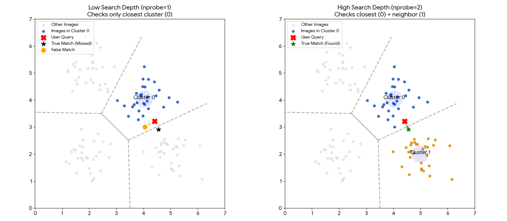

```
Document Type: User Guide

Target Audience: Non-technical users (e.g., citizen scientists, biology students, nature enthusiasts) who have no background in artificial intelligence or high-performance computing.

Primary Goals:
	- Demystify Technology: Explain AI concepts (embedding, indexing) using accessible analogies like "digital fingerprints" and "library sections."
	- Enable Usability: Define the search control sliders (Search Depth and Results per Partition) clearly so users understand how to adjust them to get better results.
	- Build Credibility: Transparently list the data sources (TreeOfLife-200M) and infrastructure (Ohio Supercomputer Center) to establish trust.

Writing Styles: 
Adheres to Ohio State FEP Technical Communication principles:
	- Audience-Centered: Translates engineering jargon into lay terms.
	- Concise
	- Precise
	- Direct
```

# How BioCLIP Image Search Works

**Purpose:** This guide explains how the BioCLIP image search tool identifies visually similar nature images from the [TreeOfLife-200M dataset](https://huggingface.co/datasets/imageomics/TreeOfLife-200M). It outlines the underlying technology and defines the search controls available to the user.

## Introduction

The BioCLIP Search tool allows you to upload a photo of a plant, animal, or fungus to find scientifically similar examples from a database of 200 million images. The system uses a specialized artificial intelligence model called **[BioCLIP 2](https://imageomics.github.io/bioclip-2/)**. Unlike standard search engines, BioCLIP 2 analyzes visual biological traits—such as evolutionary features and morphology—rather than relying on text keywords.

## Image Embedding: The "Biological Fingerprint"

Computers cannot "see" images like humans do. Instead, this tool uses BioCLIP 2 to translate your image into a structured collection of numbers, called a vector.

- **The Process:** When you upload an image, BioCLIP 2 converts it into a vector, which can be compared to the vectors of the images on which BioCLIP 2 was trained. Think of this as a **digital fingerprint** that captures the biological essence of the organism as BioCLIP 2 understands it. This collection of vectors (or fingerprints) and their relationship to each other constitute the **embedding space**.
    
- **The Match:** The vector conversion allows for a measure of the similarity (or difference) between images. Thus, your image's fingerprint is compared to the fingerprints of other images from [TreeOfLife-200M](https://huggingface.co/datasets/imageomics/TreeOfLife-200M), on which BioCLIP 2 was trained. This training captures biological relationships, the scope of which allows BioCLIP 2 to also pick up emergent features such as life stages and habitats (see the [BioCLIP 2 site](https://imageomics.github.io/bioclip-2/) and included references to learn more).

## The Search Process: A Library Analogy

Checking 214 million images one by one would take too long. To solve this, we organize the data like a giant library using the [FAISS](https://faiss.ai/index.html) software. 

1. **The Sections (Clusters):** We have divided the 214 million images into over **65,000 distinct groups** in high-dimensional space, based on the similarity (or difference) of the images. Think of these as specific sections in a library, such as "Weevils," "Ferns," or "Finches."
    
2. **The Selection:** When you search, the system first identifies which groups your image likely belongs to.
    
3. **The Retrieval:** It then searches _only_ within those specific groups to find the closest matches. This two-step process ensures results are both fast and scientifically relevant.

## Search Controls

You can adjust two settings in the application to refine your search results. These controls balance speed against thoroughness.

### 1. Search Depth (`nprobe`)

- **Definition:** The search depth parameter determines how many "library sections" (clusters) in which to search for similar "fingerprints".
    
- **Lowest Setting (Faster):** Only the single most likely group is checked. This is very fast but might miss a match if the organism is categorized in a closely related neighboring group.
    
- **Higher Setting (Thorough):** The search is performed more broadly to check multiple related groups. This increases the chance of finding the best match but takes slightly longer.
    
The chart below illustrates why increasing the Search Depth is often necessary.



**Left (Low Depth):** The user's image (Red X) falls just inside the blue region. However, the _true_ best match (Green Star) sits just across the border in the neighboring grey region. Because the system is set to look in only one region, it hits a "hard wall" and misses the best match.

**Right (High Depth):** By increasing the search depth, the system is allowed to check neighboring regions. It successfully crosses the border and finds the Green Star.

**Note on Complexity:** This visualization uses a simple flat (2-dimensional) map for clarity. The actual BioCLIP image search system operates in **768-dimensional space**. In that complex environment, "borders" are much harder to define, making it even more important to check multiple neighboring groups to ensure you don't miss a relevant result hiding "just around the corner."
### 2. Top N Results (`top_n`)

- **Definition:** The Top N Results setting controls the number of final "best matches" displayed, i.e., how many similar images are returned.
    
- **Outcome:** Increasing this number provides a wider variety of results; decreasing it shows you only the very closest matches. **Higher numbers take longer.** Retrieving more results requires the system to fetch more image files and biological details (metadata) from the disk storage space. Asking for 100 images will be slower than asking for 10.
