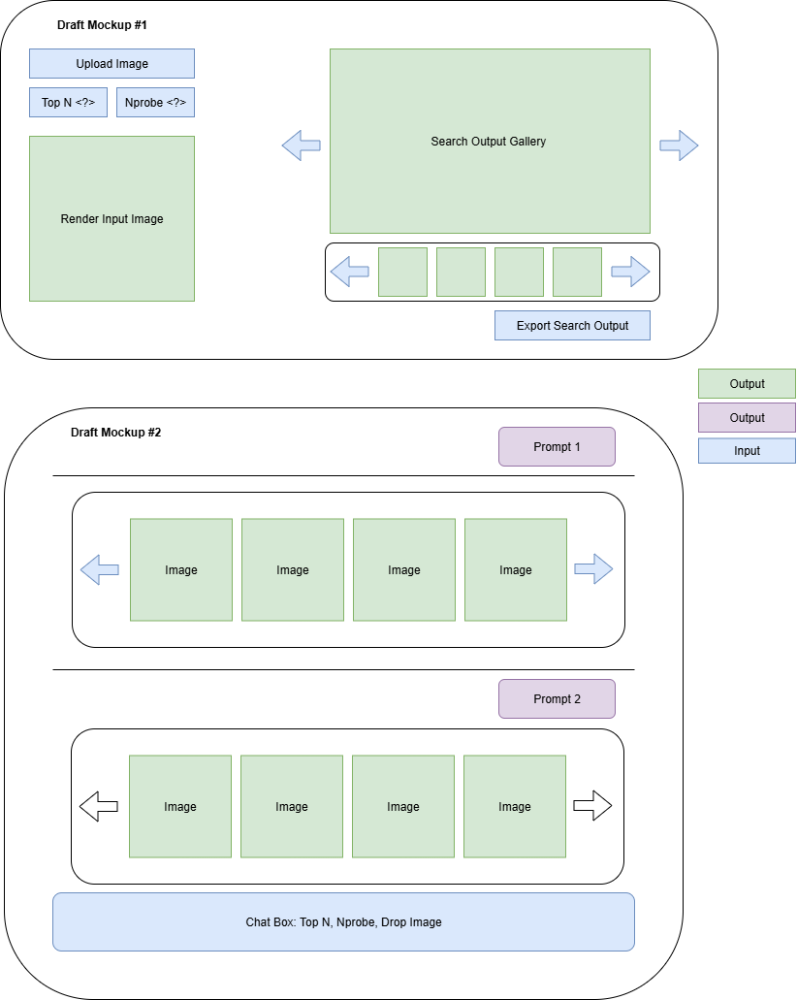

# BioCLIP Vector Database Interface Guide

This guide provides step-by-step instructions for deploying and using the BioCLIP Vector Database server on Ohio Supercomputer Center (OSC).

## Table of Contents

1. [Prerequisites](#prerequisites)
2. [Server Setup](#server-setup)
3. [Server Management](#server-management)
4. [API Usage](#api-usage)
   - [Health Check](#health-check)
   - [Vector Search](#vector-search)
5. [Example Responses](#example-responses)
6. [Web Interface](#web-interface)

## Prerequisites

- Access to OSC
- BioCLIP Vector Database environment set up (see README)
- FAISS index files available at the specified path

## Server Setup

### 1. Connect to OSC

```bash
ssh ascend.osc.edu
```

### 2. Allocate Compute Resources

Allocate 1 node on the `nextgen` partition with 60 CPU cores, 1 GPU, and a 2-hour time limit:

```bash
salloc -A PAS2136 -p nextgen -N 1 -c 60 -G 1 -t 2:00:00
```

### 3. Initialize Environment

Start a tmux session for persistent server management:

```bash
tmux new -s vector_db_server
```

Load required modules and activate the virtual environment:

```bash
module load cuda/12.4.1
source vector_db/bin/activate
```

### 4. Start the Vector Database Server

```bash
python -m src.bioclip_vector_db.query.neighborhood_server \
    --index_dir /fs/scratch/PAS2136/smenon/tol_vector_faiss_partitions \
    --index_file_prefix local_ \
    --leader_index leader.index \
    --partitions "1-999" \
    --port 5001 \
    --use_cache
```

## Server Management

### Detach from tmux Session

To keep the server running in the background:

```bash
# Press: Ctrl + B, then D
```

### Reattach to tmux Session

To reconnect to the server session:

```bash
tmux attach -t vector_db_server
```

## API Usage

The server provides a REST API with the following endpoints:

### Health Check

Check if the server is running and get status information:

```bash
curl -s -X GET -H "Content-Type: application/json" http://localhost:5001/health | jq
```

**Expected Response:**
```json
{
  "data": {
    "cache": {
      "evictions": 0,
      "hits": 0,
      "misses": 0
    },
    "dimensions": 0,
    "status": "ready",
    "vectors": 0
  },
  "status": "success"
}
```

### Vector Search

#### Manual Query Example

Search for similar vectors using a custom query vector:

```bash
curl -X POST -H "Content-Type: application/json" \
-d '{"query_vector": [0.36, 0.95, 0.22, ...], "top_n": 5, "nprobe": 1}' \
http://127.0.0.1:5001/search | jq
```

#### Using Demo Data

Search using predefined demo vectors:

**Query Example 1:**
```bash
curl -s -X POST -H "Content-Type: application/json" \
-d @docs/query_example_1.json \
http://127.0.0.1:5001/search | jq
```

**Query Example 2:**
```bash
curl -s -X POST -H "Content-Type: application/json" \
-d @docs/query_example_2.json \
http://127.0.0.1:5001/search | jq
```

#### Request Parameters

| Parameter | Type | Description | Default |
|-----------|------|-------------|---------|
| `query_vector` | array | The input vector to search for (required) | - |
| `top_n` | integer | Number of nearest neighbors to return | 10 |
| `nprobe` | integer | Number of inverted list probes for search | 1 |
| `verbose` | boolean | Enable detailed response information | false |

## Example Responses

### Successful Search Response

```json
{
  "data": {
    "merged_neighbors": [
      {
        "distance": 2.209923505783081,
        "id": "693d2c3b-5da3-41d0-b60a-f740b6384dbf"
      },
      {
        "distance": 2.216338872909546,
        "id": "78b6094c-8cfb-4f58-b191-29b51f1e1084"
      },
      {
        "distance": 2.2917332649230957,
        "id": "a8dbfadb-f2d8-4636-b826-f18392c66683"
      },
      {
        "distance": 2.3410840034484863,
        "id": "6994e4fb-cd97-4fca-8e37-05e4e0426896"
      },
      {
        "distance": 2.4090564250946045,
        "id": "089b2af8-e675-4e65-8f1c-7198b85c200f"
      }
    ]
  },
  "status": "success"
}
```

### Extended Search Results

For larger result sets (e.g., `top_n=10`):

```json
{
  "data": {
    "merged_neighbors": [
      {
        "distance": 2.209923505783081,
        "id": "693d2c3b-5da3-41d0-b60a-f740b6384dbf"
      },
      {
        "distance": 2.216338872909546,
        "id": "78b6094c-8cfb-4f58-b191-29b51f1e1084"
      },
      {
        "distance": 2.259434223175049,
        "id": "6e167cc6-89c8-464c-a619-c02911515280"
      },
      {
        "distance": 2.2806968688964844,
        "id": "25c05809-fb65-4f49-89d1-7fe86b2aa507"
      },
      {
        "distance": 2.2917332649230957,
        "id": "a8dbfadb-f2d8-4636-b826-f18392c66683"
      },
      {
        "distance": 2.3410840034484863,
        "id": "6994e4fb-cd97-4fca-8e37-05e4e0426896"
      },
      {
        "distance": 2.3526153564453125,
        "id": "a6eb257e-bbe2-4267-9376-752b76149bbf"
      },
      {
        "distance": 2.4090564250946045,
        "id": "089b2af8-e675-4e65-8f1c-7198b85c200f"
      },
      {
        "distance": 2.427694797515869,
        "id": "9d37d5cc-0fff-48f7-9085-e0defe3a89ae"
      },
      {
        "distance": 2.50883150100708,
        "id": "d3fe7f9d-bf14-4bed-9385-15db5688543f"
      }
    ]
  },
  "status": "success"
}
```

---

**Note:** Results are sorted by distance in ascending order, where lower distances indicate higher similarity to the query vector.

## Web Interface

### Front-end mockup



### Starting the Web Interface

Start the Gradio web interface with default settings:

``` bash
python app_gr.py \
    --db-server-url http://localhost:5001 \
    --host 0.0.0.0
    --port 7860 \
    --lookup-table-path /fs/scratch/PAS2136/TreeOfLife/lookup_tables/2024-05-01/hdf5/10M \
    --model hf-hub:imageomics/bioclip \

```

**Parameters:**
- `--db-server-url`: Vector database server URL (default: http://localhost:5001)
- `--host`: Host address for the Gradio server (default: 0.0.0.0)
- `--port`: Gradio app server port (default: 7860)
- `--lookup-table-path`: Path to the lookup table directory
- `--model`: BioCLIP model name (default: hf-hub:imageomics/bioclip)


**Quick Start (uses all defaults):**
``` bash
python app_gr.py
```